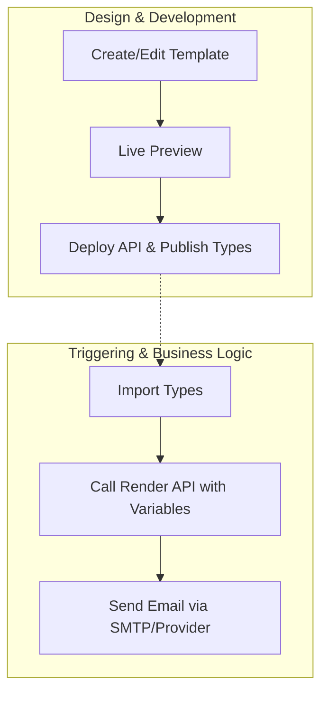

# React Email Template Bootstrap

A professional, unopinionated starting point for building and managing React-based emails across your organization.

## 🚀 The Goal
The core philosophy of this template is to decouple **Email Design** (Frontend) from **Email Triggering** (Backend). This separation allows teams to iterate on designs without touching backend business logic.



### 🎨 The Frontend (Design)
- **Tech Stack**: Built with React, Tailwind CSS, and [React Email](https://react.email/).
- **Workflow**: Designers or Frontend developers create templates in `emails/`, using a live preview server with hot reloading.
- **Output**: The project exports a **Render API** (to generate HTML/Text) and a **NPM Package** containing TypeScript definitions for all templates.

### ⚙️ The Backend (Triggering)
- **Simplicity**: The backend doesn't need to know about Email content, React, Tailwind, or complex CSS inlining. It just makes a simple HTTP request.
- **Type-Safety**: By importing the generated types, the backend gets autocompletion and compile-time validation for email variables.
- **Scalability**: The rendering logic is offloaded to a dedicated service (ideally serverless), keeping the main backend lean.

## 🛠 Features
- **Scaffolding**: `yarn gen:email` to quickly create new templates.
- **Live Preview**: Local development environment with hot reloading via [React Email](https://react.email/).
- **Type-Safe**: Automatically generates TypeScript definitions for all templates.
- **API Ready**: Built-in Express server to render emails to HTML/Text on the fly.
- **Tailwind CSS**: Pre-configured for modern styling.
- **CI/CD Ready**: Workflows for automated versioning, publishing, and deployment.

## 🏁 Quick Start

### 1. Setup the Repository
Clone this template and run the following command to rename the package scope to your organization:
```bash
yarn rename-scope @your-org
```
This will update `package.json`, `README.md`, and other relevant files.

Then, update the `repository` field in `package.json` to your GitHub URL.

Then in `server.ts`, delete the `GET /` route and `CORS origin`.

### 2. Environment Configuration
Copy `.env.sample` to `.env` and adjust as needed:
```bash
cp .env.sample .env
```
- `PORT`: (Optional) Port for the API server (default 8080).
- `BASE_URL`: The URL of your frontend application.
- `BASE_ASSET_URL`: The URL where your email assets/images are hosted.

### 3. Development Workflow

**Create a new email template:**
```bash
yarn gen:email
```
This scaffolds a new `.tsx` file in `emails/` using Plop.

**Preview emails:**
```bash
yarn dev
```
Open `http://localhost:3000` to see the live preview.

### 4. Quick Test
You can test the API immediately by visiting the **Live Playground** at [emailtemplate.kristofajosh.dev](https://emailtemplate.kristofajosh.dev).

Alternatively, use `curl` to test the API directly:
```bash
curl -X POST https://emailtemplate.kristofajosh.dev/api/render/text \
  -H "Content-Type: application/json" \
  -d '{
  "emailModule": "general",
  "template": "christmas",
  "variables": {
    "email": "user@example.com",
    "name": "John Doe"
  }
}'
```

### 5. CI/CD & Deployment

- **API**: Deploy the `Dockerfile` to your preferred host. **Serverless environments (like Google Cloud Run or AWS Fargate) are highly recommended** for cost-efficiency and automatic scaling.
- **Types**: With step 1 setup correctly, Auto publishes the package to a private registry (GitHub Packages, NPM) so your backend can consume the generated types.
Check `.github/workflows` for pre-configured GitHub Actions.

## 🔌 Backend Integration

Install your private package:
```bash
npm install @your-org/email-templates
```

_installation in the backend may require `.npmrc` file_
```text
    registry=https://registry.npmjs.org/
    @your-org:registry=https://npm.pkg.github.com/
    //npm.pkg.github.com/:_authToken=YOUR_GITHUB_TOKEN
```

Use the types to call the API with full type-safety:
```typescript
import { EmailRenderPayload } from '@your-org/email-templates';

// TypeScript will enforce correct variables based on the template!
const payload: EmailRenderPayload<'general', 'christmas'> = {
  emailModule: 'general',
  template: 'christmas',
  variables: {
    email: 'recipient@example.com',
    name: 'John Doe',
  }
};

const response = await fetch('https://your-email-api.com/api/render', {
  method: 'POST',
  body: JSON.stringify(payload),
  headers: { 'Content-Type': 'application/json' }
});

const { html, text } = await response.json();
```

## 📜 API Reference
- `POST /api/render`: Returns JSON `{ html: string, text: string }`.
- `POST /api/render/html`: Returns raw HTML body.
- `POST /api/render/text`: Returns plain text body.

## 🧪 Scripts
- `yarn dev`: Start the preview server.
- `yarn dev:api`: Start the API server locally.
- `yarn gen:email`: Scaffold a new email.
- `yarn gen:templates`: Re-generate the template index and types.
- `yarn build:api`: Build the production API.
- `yarn build:types`: Build the TypeScript definitions.
- `yarn rename-scope @your-org`: Rename the package scope across the project.

## 📄 License
This project is licensed under the MIT License - see the [LICENSE](LICENSE) file for details.

---
If this project helped you, please consider giving it a star!